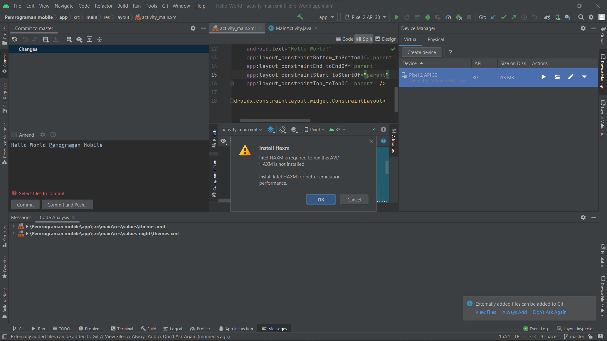

Tugas 1
Membuat project hello world di Android Studio, lalu push ke repository GitHub Anda dg nama hello-world-android

Kumpulkan link repo tsb ke LMS!

Nama : M Dwihardik K Putra
NIM : 2041720256

